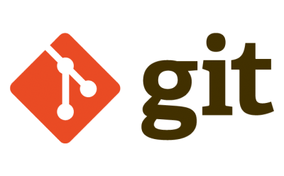
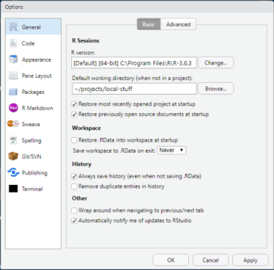

```{r setup, include=FALSE}
knitr::opts_chunk$set(echo = FALSE,
                      options(citation.bibtex.max=999))
```

# Installing R

## Windows Installation

Before we do anything else, we need to install R.

If you're using Windows, you have two options: either the base R package from CRAN-R, or the Microsoft R Open (MRO) version.  Although Microsoft has packed a lot of good features into their R package, including some performance enhancement, it lags WAY behind CRAN-R in versioning.  Your call, but I personally use the CRAN-R distribution.

Here are the links:

MRO: [https://mran.microsoft.com/open](https://mran.microsoft.com/open)

CRAN-R: [https://cran.r-project.org/](https://cran.r-project.org/)

If you go the CRAN-R route, I'd advise installing both the **base** package and **RTools**, which will allow you to install packages from source.

## Mac Installation

If using a Mac, I recommend using Homebrew to install it. Installation is simple and pain-free.  First, install xcode command line tools to support compiling from source.

```
xcode-select --install
```

Then, install Homebrew

```
/usr/bin/ruby -e "$(curl -fsSL https://raw.githubusercontent.com/Homebrew/install/master/install)"
```

Finally, install R:

```
brew install r
```

Supposedly, you can skip this and use ```brew cask install rstudio ``` to install both R and RStudio, but I haven't been able to confirm this.

# Git and Github

## Installing git

Go Here to download git-scm:



[https://git-scm.com/](https://git-scm.com/)

## Setting up Github


Create a Github Account (It's free!)

[https://github.com/](https://github.com/)

## Add an SSH Key to Github

Adding an SSH Key will make it easy to use git/github integration in RStudio without having to constantly type passwords.  Setup looks scary, but is actually quite easy if you follow the instructions [here](https://help.github.com/articles/generating-an-ssh-key/).  See the screenshare below to see how to get started.

[https://recordit.co/MninRiWd5k#](https://recordit.co/MninRiWd5k#)

# R Studio

## Installing RStudio


Windows:

[https://rstudio.com/products/rstudio/download/](https://rstudio.com/products/rstudio/download/)

Or Mac:

```
brew cask install rstudio
```

## Setting RStudio Defaults

Go to **Tools** and select **Global Options...**



## Installing Packages

To install packages, use the _install.packages_ command in R.  For example, to install tidyverse, which contains dplyr, ggplot2, tidyr, and a number of other useful tools.  [https://www.tidyverse.org/](https://www.tidyverse.org/), use the following:

```install.packages(tidyverse)```

Here is a simple command to install all the dependencies of this project:

```install.packages(c('broom','DBI','data.table','dbplyr','hexbin', 'janitor','keyring','lubridate','RColorBrewer','RSQLite'))```

_Depending on your connection speed, this might take a while._

## RStudio Features
* Basic Features
* File Types
    - Scripts
    - Notebooks
    - Presentations
    - Documents

_Note: this presentation is an R Markdown document._


## Using RMarkdown to Make Production-quality Documents

Markdown Cheat Sheet

[https://github.com/adam-p/markdown-here/wiki/Markdown-Cheatsheet](https://github.com/adam-p/markdown-here/wiki/Markdown-Cheatsheet)

RMarkdown Cheat Sheet

[https://rmarkdown.rstudio.com/lesson-15.html](https://rmarkdown.rstudio.com/lesson-15.html)

RMarkdown Reference

[https://rstudio.com/wp-content/uploads/2015/03/rmarkdown-reference.pdf](https://rstudio.com/wp-content/uploads/2015/03/rmarkdown-reference.pdf)

## R Markdown Documents

R Markdown permits you to integrate code, tables, and plots into your document output.  Basic document types:

* R Script: This is a simple text file with R commands that can be run directly from the R kernel.
* R Notebook: This is an RMarkdown document that is useful for documenting work
* R Markdown Presentation: an HTML presentation in one of many flavors.  This presentation is in _ioslides_.
* R Markdown Document: Generates HTML, PDF, Word, or other formats.
* R Markdown with Shiny: Generates interactive documents
* Shiny Web App: Generates a hostable HTML application using R
* Plus many others...

## R Version

Built with R `r getRversion()`